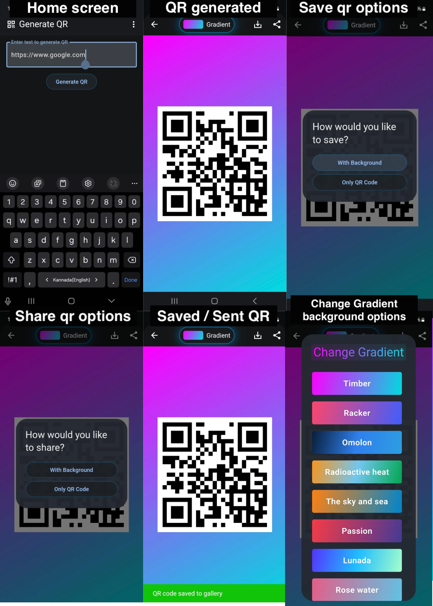

# QR Code App

## Table of Contents

1. [Overview](#overview)
2. [Features](#features)
   - [QR Code Scanner](#qr-code-scanner)
   - [QR Code Generator](#qr-code-generator)
3. [Download APK](#apk-download)
4. [Screenshots](#screenshots)
5. [Installation](#installation)
6. [License](#license)

## Overview <a name="overview"></a>

QR Code App is a Flutter application designed to provide users with the ability to both scan and generate QR codes conveniently. It offers fast scanning capabilities, supports various types of QR code content including URLs, UPI payments, SMS, mail, location coordinates, NFC, and MMS. The QR code generator allows users to create QR codes for any type of text, with customization options such as size adjustment, gradient background selection, shape modification (square or circle), color alteration, and image embedding.

## Features <a name="features"></a>

### QR Code Scanner <a name="qr-code-scanner"></a>

- Fast scanning of QR codes
- Supports various types of QR code content including URLs, UPI payments, SMS, mail, location coordinates, NFC, and MMS
- Flash and flip camera settings for user convenience
- Ability to redirect to websites when scanning URLs

### QR Code Generator <a name="qr-code-generator"></a>

- Generates QR codes for any type of text
- Adjusts QR code size based on input text length
- Provides various gradient options for background customization
- Option to customize QR code shape (square or circle)
- Allows changing QR code colors
- Enables image embedding into QR codes
- Ability to save generated QR codes to the device gallery with or without gradient background
- Supports direct sharing of generated QR codes to other applications

## APK Download <a name="apk-download"></a>

You can download the latest version of the My Awesome App APK from the following link:

[Download APK](https://github.com/chetanr250/qr_code/raw/main/demo_imgs/app-release.apk)

## Screenshots <a name="screenshots"></a>



](demo_imgs/generate_qr.png)

### [Gradient backgroud feature video](demo_imgs/gradient_demo.mp4)

](demo_imgs/custom_qr_image.png)

### [Customize QR Code Video](demo_imgs/custom_qr_video.mp4)

](demo_imgs/qr_scanner_image.jpeg)

### [Scan QR Code Video](demo_imgs/QR_scanner.mp4)

## Installation <a name="installation"></a>

Clone the repository to your local machine:

```bash
git clone https://github.com/chetanr250/qr_code
cd qr_code
flutter pub get
flutter run
```

## License

This project is licensed under the MIT License - see the [LICENSE](LICENSE) file for details.
