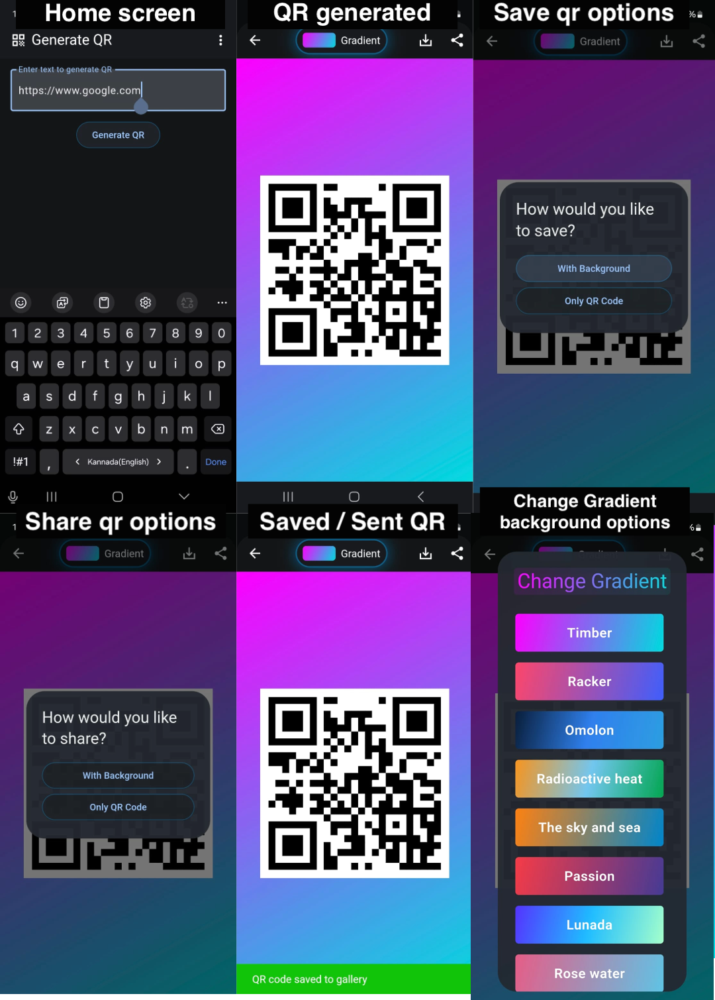
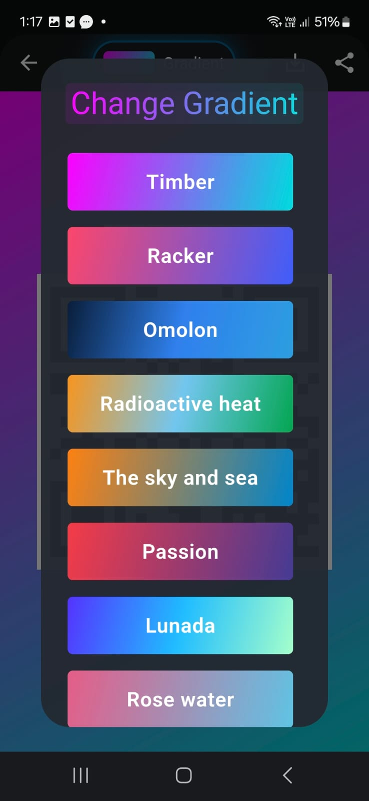
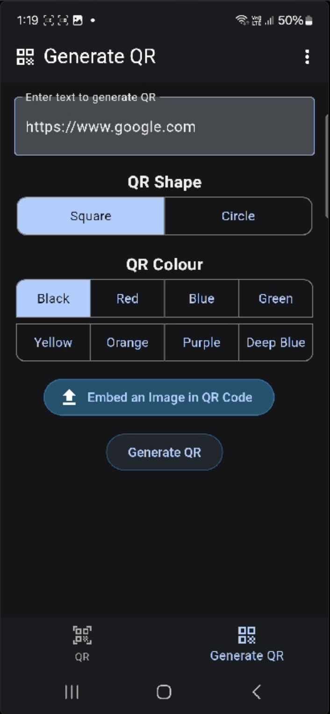
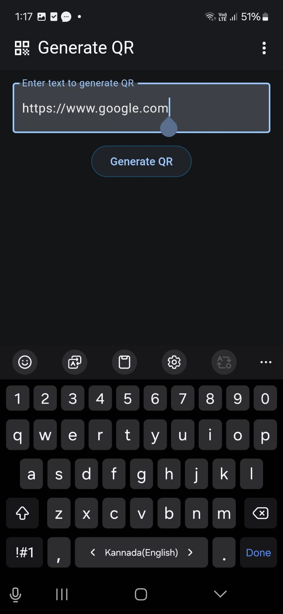

# **QR Code App** 🚀

## **Table of Contents** 📖

1. [**Overview**](#overview)
2. [**Features**](#features)
   - [**QR Code Scanner**](#qr-code-scanner)
   - [**QR Code Generator**](#qr-code-generator)
3. [**Screenshots**](#screenshots)
4. [**Installation**](#installation)
5. [**License**](#license)

---

### **Download APK** 📥

[](https://github.com/chetanr250/qr_code/raw/main/demo_imgs/app-release.apk)

---

## **Overview** 🖥️ <a name="overview"></a>

**QR Code App** is a powerful **Flutter application** that enables users to both **scan** and **generate QR codes** with ease. 

### **Key Highlights** ✨:

- **⚡ Fast and reliable scanning** for QR codes, supporting content like **URLs**, **UPI payments**, **SMS**, **emails**, **locations**, **NFC**, and **MMS**.
- A versatile **QR Code Generator** with options for:
  - 🖌️ **Custom sizes**
  - 🌈 **Gradient backgrounds**
  - 🔲 **Shape modifications** (square or circle)
  - 🎨 **Color adjustments**
  - 🖼️ **Image embedding**

---

## **Features** 🛠️ <a name="features"></a>

### **QR Code Scanner** 🔍 <a name="qr-code-scanner"></a>

- **⚡ Lightning-fast scanning**
- Supports a variety of QR code content: **🌐 URLs**, **💳 UPI payments**, **✉️ SMS**, **📧 mail**, **📍 locations**, and **📡 NFC**.
- Includes **🔦 flash** and **🔄 camera flip** for convenience.
- **🌐 Auto-redirects** to websites when scanning URLs.

---

### **QR Code Generator** 🖼️ <a name="qr-code-generator"></a>

- **Generate QR codes** for any text type.
- 📏 Adjust QR code **size** dynamically.
- 🌈 Choose from various **gradient backgrounds**.
- 🔲 Customize QR code **shapes** (square or circle) and **colors**.
- 🖼️ Embed **images** into QR codes.
- 💾 **Save** QR codes to your gallery with or without gradient backgrounds.
- 🔗 **Share QR codes** directly to other apps.

---

## **Screenshots** 📸 <a name="screenshots"></a>



### [**Gradient Background Feature Video** 🎥](demo_imgs/gradient_demo.mp4)

[](demo_imgs/gradient_demo.mp4)

### [**Customize QR Code Video** 🎥](demo_imgs/custom_qr_video.mp4)

[](demo_imgs/custom_qr_video.mp4)

### [**Scan QR Code Video** 🎥](demo_imgs/QR_scanner.mp4)

[](demo_imgs/QR_scanner.mp4)

---

## **Installation** ⚙️ <a name="installation"></a>

Clone the repository and get started:

```bash
git clone https://github.com/chetanr25/qr_code
cd qr_code
flutter pub get
flutter run
```

---

## **License** 📜 <a name="license"></a>

This project is licensed under the **MIT License**. See the [LICENSE](LICENSE) file for more details.

---

✨ **Empowering QR code interactions with unmatched customization and ease!** ✨
